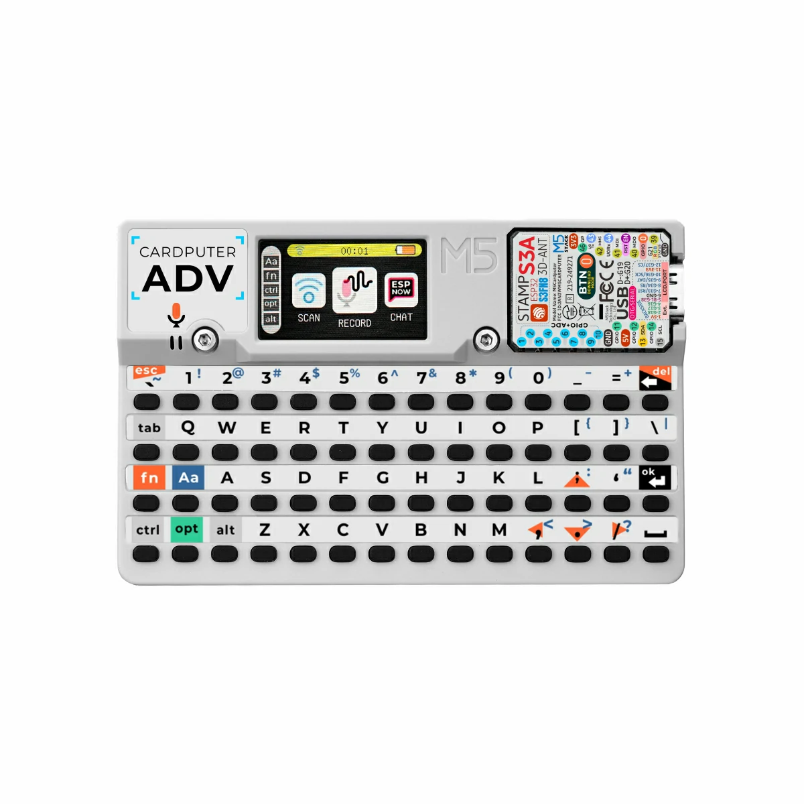

# Cardputer ADV OS 1.0

Custom lightweight operating system / firmware for **M5Stack Cardputer** (ESP32-S3).

The goal of this project is to turn the compact Cardputer into a powerful, user-friendly multi-purpose device with a smooth graphical interface, SD card support, Wi-Fi capabilities, and room for future expansion.


## Screenshots

Here are some glimpses of the interface:

<p align="center">
  
  <br>
  <em>Main interface with custom theme and SD card support</em>
</p>

More screenshots will be added as the project develops.


## Current Features

- Graphical user interface (LVGL + M5GFX)
- Double buffering for smooth images and animations
- Customizable color themes / gamma settings
- Fully working keyboard support
- SD card initialization & basic file system access
- High-resolution icons support (100×100 pixels)
- Foundation ready for Wi-Fi, OTA updates, and security testing applications

## Requirements

- **Hardware**: M5Stack Cardputer (ESP32-S3)
- **Development environment**: Visual Studio Code + PlatformIO extension
- **Dependencies**: Listed in `platformio.ini` (LVGL, M5GFX, SD libraries, etc.)

## Quick Start

1. Clone the repository

   ```bash
   git clone https://github.com/tSu725/CardputerADV_OS_1.0.git
   cd CardputerADV_OS_1.0